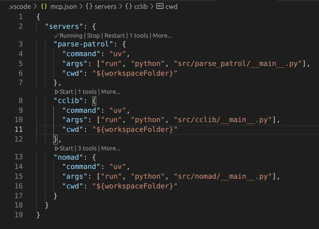

# parse-patrol

## Project Overview

Submission for LLM Hackathon in Materials Science and Chemistry 2025.
A Python-based testing ground for MCP (Model Context Protocol) servers, parsing tools, and agent-generated pipelines. It should support any arbitrary format specified by the user. Designed for LLM agent integration in IDEs like VS Code.

Parse-patrol showcases the **added benefit of MCP** for agents:

- _semantic robustness_ via well-defined and test parser code.
- lowered resource consumption, i.e. less thought iterations.
- quick and modular _patching of knowledge gaps_.

This means introducing _redundancy in tooling_, so the agent can choose and test from multiple resources.

### Supported Servers

Currently available:

- cclib
- custom_gaussian

Planned:

- openbabel
- nomad-lab (?)

Potential development routes -aside from extending tooling- include:

- adding documentation on the parsers and quantum chemistry software via RAG/MCP.
- proving the modularity of LLM: integrating with another agent, e.g. Claude.
- coding our own, smaller and more modular parsing functions.
- using multiple agents for orchestrating complex tasks.

## Installation

There is currently only a development version of this project.
Firstly, `git clone` this repository to your own local machine.

This project is managed via `uv` for Python.
Dependencies are set in `pyproject.toml` and are updated via `uv sync`.
To execute any script, use `uv run python <filepath>` (automatically calls `uv sync`).

To try out individual Python sessions open a new bash shell.
Then activate the virtual environment via `. .venv/bin/activate`.You can now initiate your Python session (`python`).

## Manual Testing setup
MCP primitives developed for a single server can be tested using [MCP instructor](https://github.com/modelcontextprotocol/inspector). The problem with it can not handle multiple servers at once. So, it requires to test each server individually. (We did not find the way to inspect multiple servers at once using MCP inspector).
```
uv run mcp dev <path-to-server-file e.g., src/nomad/__main__.py>
```
Then click on the url link appeared on the terminal to open the MCP inspector in the browser or inspector will automatically open in browser.

To run and test all the servers together in VS Code, as a client, list your servers in a `json` file e.g., `.vscode/mcp.json` and VSCode will be capable of detect the servers and can be run on the clicking button above the server (appeared in the VSCode UI).



Example of `mcp.json` listing all the servers:
```Json
{
  "servers": {
    "parse-patrol": {
      "command": "uv",
      "args": ["run", "python", "src/parse_patrol/__main__.py"],
      "cwd": "${workspaceFolder}"
    },
    "cclib": {
      "command": "uv",
      "args": ["run", "python", "src/cclib/__main__.py"],
      "cwd": "${workspaceFolder}"
    },
    "nomad": {
      "command": "uv",
      "args": ["run", "python", "src/nomad/__main__.py"],
      "cwd": "${workspaceFolder}"
    }
  }
}
```

## Project Structure

```
parse-patrol/
├── src/
│   ├── parse_patrol/             # Unified MCP server entrypoint, collects all subservers
│   ├── parsers/                  # Parsing tools with their own MCP server in `__main__.py`
│   └── utils/                    # Shared utilities/helpers
├── scripts/                      # (Currently empty) CLI tools, setup scripts, etc.
├── .pipelines/                   # Scripts and data for parsing pipelines
│   ├── scripts/                  # Agent-generated pipeline scripts and examples
│   └── data/                     # Test data files for pipeline processing
├── .resources/                   # Schema and documentation resources
│   ├── semantic-schema.md        # Semantic schema definitions
│   └── structure-schema.md       # Structure schema definitions
└── .data/                        # Data files downloaded by nomad MCP, to parse by the agent
├── pyproject.toml
├── README.md
├── LICENSE
```

## Usage

- **VS Code**: A central access server with all functional tools is registered under `.vscode/mcp.json` (copy from `.vscode/mcp.template.json`). It can be run from this file in the IDE, or found under the extensions the (`Ctrl+Shift+X` on Ubuntu). Once the server is started, it will be available to the `Agent` mode in co-pilot `CHAT` (make sure to switch your co-pilot from `Ask/Edit` to `Agent` mode!!!).

There are now various prompts available. Type slash (`/`) in the chat window and wait for auto-complete.
All prompts should show under `/mcp.parse-patrol.<prompt path>`. Note that the MCP server name may change when published under a different or multiple servers. While you are executing the slash commands, you can find the description of the required and optional input above the bar where you are entering the info (it is not very obvious at first).

Some prompts are dynamic and will request fields to filled in. When a field is optional, it will be marked as such. Finally, the full prompt will be returned to the chat input field, ready to be submitted.
Editing is still possible at this step.

PITFALL: do not use the file explorer for adding fields. This will copy-paste the file contents, NOT the file path.

### Starting the MCP servers remotely

In VS Code, go t the command prompt, type `> mcp` and select "MCP: Open Remote User Configuration". It will open up a `mcp.json` file, where you can paste in your MCP server configurations.

## Development

Develop servers for each tool individually. Each tool has its own dedicated folder under `src/parsers/`. Define their MCP servers in `__main__.py`.

For testing of a new server, add it to IDE as outlined above.
Once the servers passes the checks, register the new MCP server:

- to unified interface in `src/parse_patrol/`. **Only the central interface is exposed in `main` branch!** This allows agents and users to access all parsing tools via a single, clear server endpoint.
- in this `README.md`, if this is a new tool.

Testing is done 2 ways:

- the agent attempts to generate pipeline scripts. Successful cases may be stored under in `.pipelines/scripts/`. The input to be processed is found in `.pipelines/data/`. Schema definitions and documentation resources are available in `.resources/`.
- test the parser and server code in `tests/`.

## Online Resources

The following links explain the basics of MCP, including the distinction between _tools_, _resources_, and _prompts_. **Make sure to respect these distinctions!**

- Basics
  - Full repo and README of the MCP Python SDK: https://github.com/modelcontextprotocol/python-sdk
  - The FastMCP package docs: https://gofastmcp.com
- Advanced
  - JSON-RPC: foundational protocol that formalizes MCP server-client communication. It is transport-layer agnostic: https://www.jsonrpc.org/specification
- VS Code
  - detailed MCP server setup and management: https://code.visualstudio.com/docs/copilot/customization/mcp-servers
- cclib
  - Docs explaining the supported fields and codes: https://cclib.github.io/data.html
  - Repo for in-depth navigation of the code: https://github.com/cclib

## Demo video clip

  