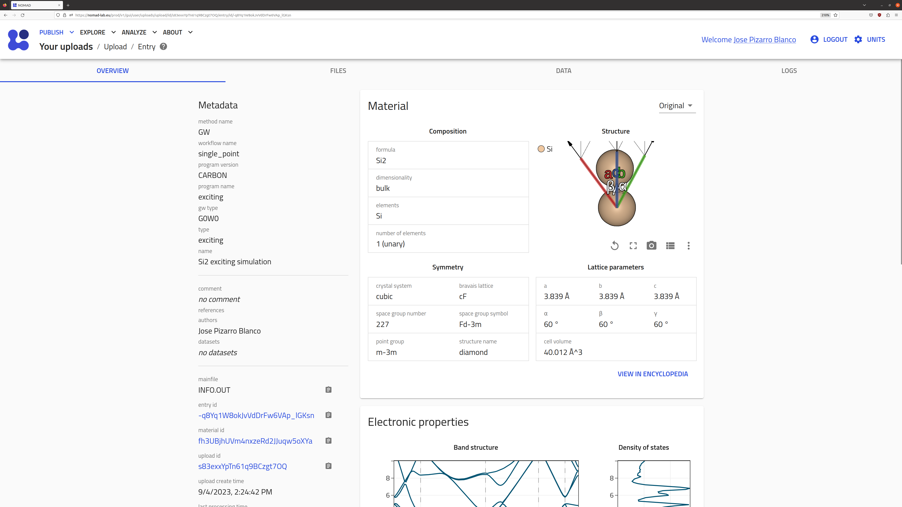
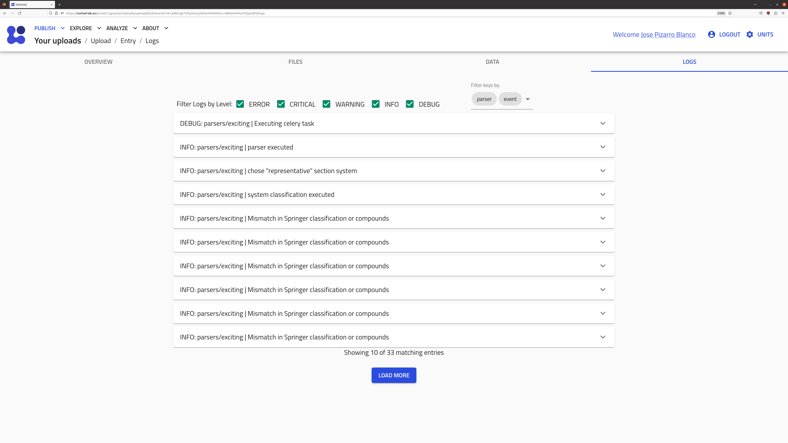

# NOMAD Basics: A Computational Perspective

## What you will learn

- An overview of how NOMAD processes and organizes computational data.

## Recommended preparation

- [Tutorial > Navigating to NOMAD](../../tutorial/nomad_repo.md)
- [Tutorial > Uploading and publishing data](../../tutorial/upload_publish.md)
- [Tutorial > Exploring data](../../tutorial/explore.md)

## Further resources

- [Tutorial > Managing workflows and projects](../../tutorial/workflows_projects.md)
- [How-to guides > Programmatic use > Publish data using Python](../../howto/programmatic/publish_python.md)
- [How-to guides > Customization > Define Workflows](../../howto/customization/workflows.md)

## Processing of supported simulation data

NOMAD ingests the raw input and output files from standard simulation software by first identifying a representative file (denoted the **mainfile**) and then employing a [Parser](../../reference/glossary.md#parser) code to extract relevant (meta)data from not only the mainfile, but also other files (**auxillary files**) associated with that simulation via the parser.

    <label>
        <input type="checkbox">
        
    </label>

The extracted (meta)data are stored within a structured schema&mdash;the NOMAD [Metainfo](../../reference/glossary.md#metainfo)&mdash;to provide context for each quantity, enabling interoperability and comparison between, e.g., simulation software. The Metainfo is constructed from [Sections and Subsections](../../reference/glossary.md#section-and-subsection) and [Quantities](../../reference/glossary.md#quantity), which can be conveniently browsed by users with the [Metinfo Browser](https://nomad-lab.eu/prod/v1/gui/analyze/metainfo){:target="_blank"}:

    <label>
        <input type="checkbox">
        
    </label>

In the same upload, there might be multiple mainfiles and auxiliary files organized in a folder tree structure. A separate [Entry](../../reference/glossary.md#entry) will be created for each mainfile identified. For each entry, an [Archive](../../reference/glossary.md#archive) is created that contains all the extracted (meta)data in a *structured*, *well defined*, and *machine readable* format. This **metadata** provides context to the raw data, i.e., what were the input methodological parameters, on which material the calculation was performed, etc.

See the explanation pages [From files to data](../../explanation/basics.md), [Data structure](../../explanation/data.md) and [Processing](../../explanation/processing.md) for a more general description of NOMAD processing.

<!--TODO: add our own supported parsers list with improved info-->
See [Supported Parsers](https://nomad-lab.eu/prod/v1/staging/docs/reference/parsers.html){:target="_blank"} for a full list of supported codes, mainfiles, auxiliary files, etc.

## Archive sections relevant for computational data

Under the [`Entry` section of the metainfo browser](https://nomad-lab.eu/prod/v1/gui/analyze/metainfo/nomad.datamodel.datamodel.EntryArchive){:target="_blank"}, there are several sections and quantities being populated by the parsers. For computational data, the relevant sections are:

- `metadata`: contains general and non-code specific metadata. This is mainly information about authors, creation of the entry time, identifiers (id), etc.
- `run`: contains the [Parsed](../../explanation/processing.md#parsing) and [Normalized](../../explanation/processing.md#normalizing) raw data, according to the *legacy* NOMAD simulation schema, [`runschema`](https://nomad-lab.eu/prod/v1/gui/analyze/metainfo/runschema).
- `data`:  contains the [Parsed](../../explanation/processing.md#parsing) and [Normalized](../../explanation/processing.md#normalizing) raw data, according to the *new* NOMAD simulation schema, [`nomad_simulations`](https://nomad-lab.eu/prod/v1/gui/analyze/metainfo/nomad_simulations).
- `workflow2`: contains metadata about the specific workflow performed within the entry. This is mainly a set of well-defined workflows, e.g., `GeometryOptimization`, and their parameters.
- `results`: contains the [Normalized](../../explanation/processing.md#normalizing) and [Search Indexed](../../explanation/basics.md#storing-and-indexing) metadata. This is mainly relevant for searching, filtering, and visualizing data in NOMAD.

### Normalization

The parser code reads the code-specific mainfile and auxiliary files and populates the `run` and `workflow2` sections of the `archive`. Subsequently, a cascade of additional code is executed, which varies depending on the exact sections and quantities populated by the parser. This code is responsible for: 1. normalizing or *homogenizing* certain metadata parsed from different codes, and 2. populating the `results` section.

### Search indexing

Only a fraction of the stored metadata is made avaialable for search. In terms of the parsed and normalized quantities, the `results` section stores the searchable quantities. These metadata can be use to filter the database via the GUI or API.

## Organization in NOMAD

### Entries

The compilation of all (meta)data obtained from processing of a single mainfile forms an entry&mdash;the fundamental unit of storage within the NOMAD database&mdash;including simulation input/output, author information, and additional general overarching metadata (e.g., references or comments), as well as an `entry_id`&mdash;a unique identifier.

Once the processing is finished, the uploads page will show if each mainfile process was a `SUCCESS` or `FAILURE`. The entry information can be browsed by clicking on the :fontawesome-solid-arrow-right: icon. The GUI provides the following structure for navigating an entry:

**OVERVIEW tab**

{.screenshot}

The overview page contains a summary of the parsed metadata, e.g., tabular information about the material and methodology of the calculation (in the example, a G0W0 calculation done with the [exciting](https://www.exciting-code.org/){:target="_blank"} code for bulk Si2), along with a visualization of the system and some relevant properties.

**FILES tab**

The files page contains a browser for the uploaded file structure, with tools for viewing both the processed and raw data.

<!-- TODO - Add image -->

**DATA tab**

The `DATA` page contains a browser for searching through the metadata stored for the entry, according to the NOMAD Metainfo structure. A downloadable JSON version of the archive can be accessed by clicking on the :fontawesome-solid-cloud-arrow-down: icon.

{.screenshot}

**LOGS tab**

The `LOGS` page contains a list of info, warning, and error messages from the processing codes (i.e., parsers and normalizers). These provide insight into any potential issues with the upload, especially in the case that the entry displays the `FAILURE` processing status. Please help improve NOMAD by reporting any major issues that you find: [NOMAD > Support](https://nomad-lab.eu/nomad-lab/support.html){:target="_blank"}.

{.screenshot}

### Uploads

NOMAD entries can be organized hierarchically into uploads. Since the parsing execution is dependent on automated identification of representative files, users are free to arbitrarily group simulations together upon upload. In this case, multiple entries will be created with the corresponding simulation data. An additional unique identifier, `upload_id`, will be provided for this group of entries. Although the grouping of entries into an upload is not necessarily scientifically meaningful, it is practically useful for submitting batches of files from multiple simulations to NOMAD.

### Workflows

NOMAD offers flexibility in the construction of workflows. NOMAD also allows the creation of custom workflows, which are completely general directed graphs, allowing users to link NOMAD entries with one another in order to provide the provenance of the simulation data. Custom workflows are contained within their own entries and, thus, have their own set of unique identifiers. To create a custom workflow, the user is required to upload a workflow yaml file describing the inputs and outputs of each entry within the workflow, with respect to sections of the NOMAD Metainfo schema.

### Datasets

At the highest level, NOMAD groups entries with the use of data sets. A NOMAD data set allows the user to group a large number of entries, without any specification of links between individual entries. A DOI is also generated when a data set is published, providing a convenient route for referencing all data used for a particular investigation within a publication.

<!-- TODO - add some diagrams to explain the organization and remove anything that is not necessary to explain here? -->
