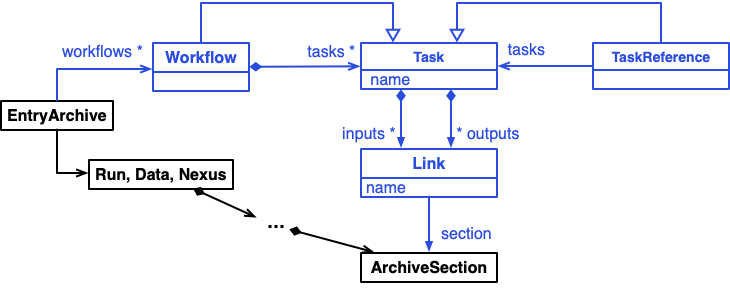
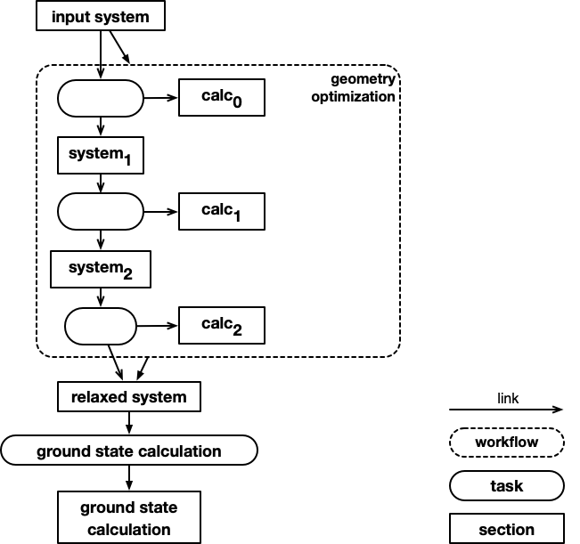

# Workflows

## The built-in abstract workflow schema

Workflows are an important aspect of data as they explain how the data came to be. Let's
first clarify that *workflow* refers to a workflow that already happened and that has
produced *input* and *output* data that are *linked* through *tasks* that have been
performed . This often is also referred to as *data provenance* or *provenance graph*.

The following shows the overall abstract schema for *worklows* that can be found
in `nomad.datamodel.metainfo.workflow` (blue):

In this UML diagram, filled diamonds denote a “contains“ relationship with the
diamond on the containing section. Open arrows denote inheritance and point to the parent section.
Filled arrows denote sub-sections, named with the arrow label and defined by the section the arrow
is pointed towards.

The idea is that *workflows* are stored in a top-level archive section along-side other
sections that contain the *inputs* and *outputs*. This way the *workflow* or *provenance graph*
is just additional piece of the archive that describes how the data in this (or other archives) is connected.

### Example workflow

Consider an example *workflow* consisting of a geometry optimization and ground state
calculation performed by two individual DFT code runs. The code runs are stored in
NOMAD entries `geom_opt.archive.yaml` and `ground_state.archive.yaml` using the `run`
top-level section.

Here is a logical depiction of the workflow and all its tasks, inputs, and outputs.

### Standardized versus custom workflows

!!! Warning
    Coming soon...

<!-- TODO - add description here -->

<!-- Below is text copied directly from a book chapter explaining NOMAD workflows, it should be adapted for the docs

\subsection{Workflow storage in NOMAD} \label{sec:NOMAD}

To present NOMAD's workflow support, it is useful to first describe its basic organization and corresponding terminology. The fundamental unit of storage within the NOMAD repository is an \emph{entry}. Each entry contains both the raw uploaded files as well as an ``archive,'' \ie the extracted (meta)data stored within NOMAD's structured data schema. NOMAD entries can be organized hierarchically into uploads, workflows, and datasets. Users can arbitrarily group simulations together upon upload. NOMAD's parsing interface will automatically identify supported simulations and create individual entries for each of them. Datasets allow users to group entries together that were not necessarily uploaded or published at the same time, while obtaining a single DOI for a collection of data. Finally, workflows provide directed connections between entries (or between metadata sections within entries), along with additional surrounding metadata, that facilitate specific scientific processes to be documented in great detail. This organization of data provides ample flexibility for researchers to conveniently manage their data at various stages of the project life cycle.

Within its core schema, NOMAD represents workflows as a collection of inputs, outputs, and tasks. The tasks themselves contain inputs and outputs, each with a link to specific sections or quantities within the archive of a particular entry, as demonstrated in Fig.~\ref{fig:nomad_workflows_a}. Task references are proxy tasks used to compose workflows or tasks that are contained in different entries. In this way, any workflow in NOMAD can be mapped to a directed graph structure. The simplicity of this schema enables immense flexibility, \eg the creation of hierarchical workflows with tasks that represent an underlying sub-workflow, as demonstrated by the example workflow shown in Figure~\ref{fig:nomad_workflows_b}.

% \begin{figure}[h!]
% \centering
% \includegraphics[width=0.72\linewidth]{chapters/Workflow_Schema.jpg}
% \caption{(a) UML diagram representing the core workflow schema in NOMAD. Filled diamonds denote a ``contains`` relationship with the diamond on the containing section. Open arrows denote inheritance and point to the parent section. Filled arrows denote sub-sections, named with the arrow label and defined by the section the arrow is pointed towards. (b) Example schematic of a hierarchical workflow according to the NOMAD schema. The ``system`` and ``calc`` sections represent the structure and output (meta)data, respectively, for an individual simulation entry. The arrows in this panel represent the edges between workflow tasks, distinct from the meaning of the filled errors in panel (a). Figure adapted from the NOMAD documentation~\cite{NOMADDocs}.
% \label{fig:nomad_workflows}}
% \end{figure}

\begin{figure}[h!]
\centering
\includegraphics[width=\linewidth]{chapters/workflow_schema_a.jpg}
\caption{UML diagram representing the core workflow schema in NOMAD. Filled diamonds denote a ``contains`` relationship with the diamond on the containing section. Open arrows denote inheritance and point to the parent section. Filled arrows denote sub-sections, named with the arrow label and defined by the section the arrow is pointed towards. Figure adapted from the NOMAD documentation~\cite{NOMADDocs}.
\label{fig:nomad_workflows_a}}
\end{figure}

\begin{figure}[h!]
\centering
\includegraphics[width=0.6\linewidth]{chapters/workflow_schema_b.jpg}
\caption{Example schematic of a hierarchical workflow according to the NOMAD schema. The ``system`` and ``calc`` sections represent the structure and output (meta)data, respectively, for an individual simulation entry. The arrows represent the edges between workflow tasks, distinct from the meaning of the filled errors in Fig.~\ref{fig:nomad_workflows_a}. Figure adapted from the NOMAD documentation~\cite{NOMADDocs}.
\label{fig:nomad_workflows_b}}
\end{figure}

NOMAD supports two distinct workflow implementations: custom and standardized. Custom workflows allow users to arbitrarily link NOMAD entries with one another according to the core workflow schema. In practice, this can be achieved by providing the relevant workflow information within a YAML file. The creation of such a workflow YAML involves defining connections to specific sections of the internal NOMAD metadata schema, which represents a significant barrier for non-experts. To lower this barrier, a workflow utilities module~\cite{Rudzinski2025Utility} has been developed to automate the creation of workflow YAMLs with as little NOMAD-specific user knowledge as possible. When uploaded to NOMAD, the workflow YAML is automatically processed, creating a workflow entry along with an interactive workflow graph that navigates to the referenced sub-workflows, tasks, and (meta)data. Users can adopt this approach to not only connect entries that are uploaded at the same time as the workflow YAML, but also to link to existing NOMAD entries.

Custom workflows can also be created via the ELN functionalities in NOMAD. In particular, users can utilize the ``Experiment'' ELN template, which already contains a hierarchical structure for defining a series of activities (\ie sub-workflows) and underlying steps (\ie tasks). These steps may be generally linked with lab processes (measurements, analyses, synthesis steps, etc.), and can be entered and edited directly using NOMAD's ELN user interface. The resulting populated hierarchy of experimental steps are automatically mapped and stored within NOMAD's core workflow schema, enabling a corresponding visualization via NOMAD's interactive workflow graphs, and resulting in a consistent description of experimental and computational workflows throughout the repository. In fact, ELN entries can also be leveraged to document custom tasks within a computational workflow, such as manual file manipulations or the execution of custom scripts.
% NOTES - may add more specific description/example -- Physical Vapor Deposition -- from shipment to growth, to sample, to sample cutting.
% Bundle a series of steps in the lab, preprocessing of substrate, raw file from machine performing deposition, get multilayer sample from the chamber, each sample sent to characterization,

In contrast to custom workflows, standardized workflows in NOMAD contain a well-defined structure, as determined by a specialized workflow schema. This schema may be as specific as required and may include normalization functions that, \eg extract (meta)data from individual workflow tasks (corresponding to NOMAD entries) to compile overarching statistics or analyses. For example, when one of the NOMAD parsers identifies a $GW$ calculation, which takes as input a single-point DFT calculation, a $GW$ workflow is instantiated. The preceding DFT calculation is then automatically identified and linked within the $GW$ workflow, while extracting and plotting the DFT and $GW$ band structures for comparison on the workflow overview page. Community members can implement their own standardized schemas within a NOMAD \emph{plugin}, providing a bottom-up and low-barrier route for workflow standardization.

Given a standardized workflow schema, there are two ways to create corresponding entries in NOMAD. The first is for the user to provide the workflow (meta)data within a workflow YAML, identical to the custom workflow approach. In this case, a reference to the schema is included in the workflow (meta)data, and any restrictions implied by this schema should be followed to ensure full functionality. Although it requires some knowledge of the NOMAD workflow YAML schema, this approach is accessible to researchers who have limited programming knowledge but want to document a workflow that is not already supported within NOMAD's parsers. The second, and more robust, option is automated identification and creation of standardized workflows via NOMAD's parser codes (as in the $GW$ example above). Parser plugins may be developed for both traditional simulations codes as well as for domain-specific workflow libraries. In fact, in addition to workflow support within many of NOMAD's simulation code parsers, NOMAD's workflow parsers~\cite{Ladines2025Workflow} already provide support for several of the workflow libraries from Table~\ref{tab:workflow_software}: AFLOW, ASR, FHI-vibes, and Atomate.
% AFLOW
% ASR
% Atomate
% ElaStic
% FHI-vibes
% LOBSTER
% phonopy
% QuantumEspressoEPW
% QuantumEspressPhonon
% QuantumEspressoXSpectra

In principal, parser plugins can also be developed for workflow managers, although this has not yet been implemented. Instead, recent work~\cite{Bereau2024Martignac} has opted for the reverse integration, \ie the workflow manager performs a mapping of the workflow (meta)data from its native schema to NOMAD's and creates NOMAD workflow YAMLs for upload. In this case, the integration was implemented into an interfacing module that links the workflow manager and NOMAD, while standardizing the execution of domain-specific workflows. It was demonstrated that this approach may be advantageous for modular and dynamic workflows, as on-the-fly NOMAD queries can be executed to utilize existing data in the NOMAD repository. Thus, it is especially relevant for high-throughput applications.

Overall, NOMAD provides a variety of flexible options for retaining data provenance through the hierarchical storage of directed tasks and associated (meta)data. While custom workflows are essential for agile usage and development, promoting immediate adoption of FAIR data management practices, standardized workflows enable powerful search, visualization, and analysis features. The creation of specific workflow entries via parser plugins (Python-based), NOMAD's native workflow schema (YAML-based), and the ELN user interface (web-based GUI), provide a range of approaches accessible to all researchers. Thus, NOMAD fosters a dynamic ecosystem of workflow support that paves the way for FAIR workflow data management.  -->