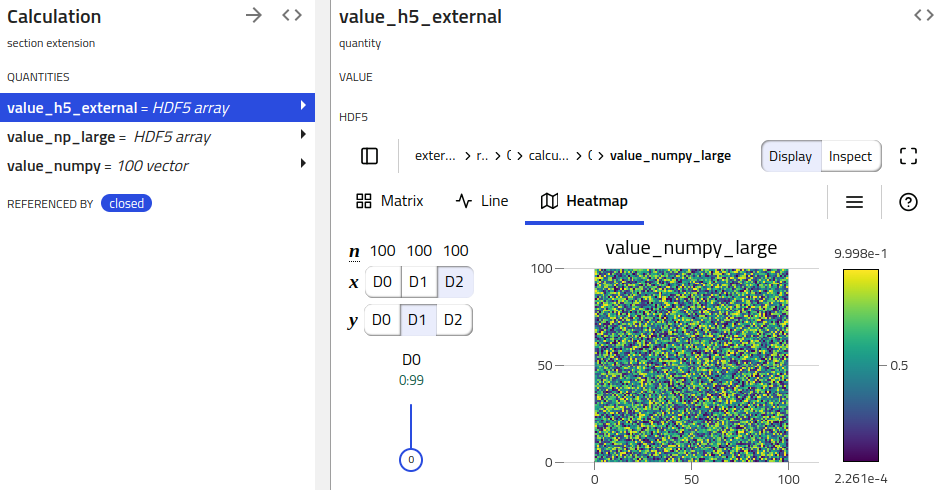
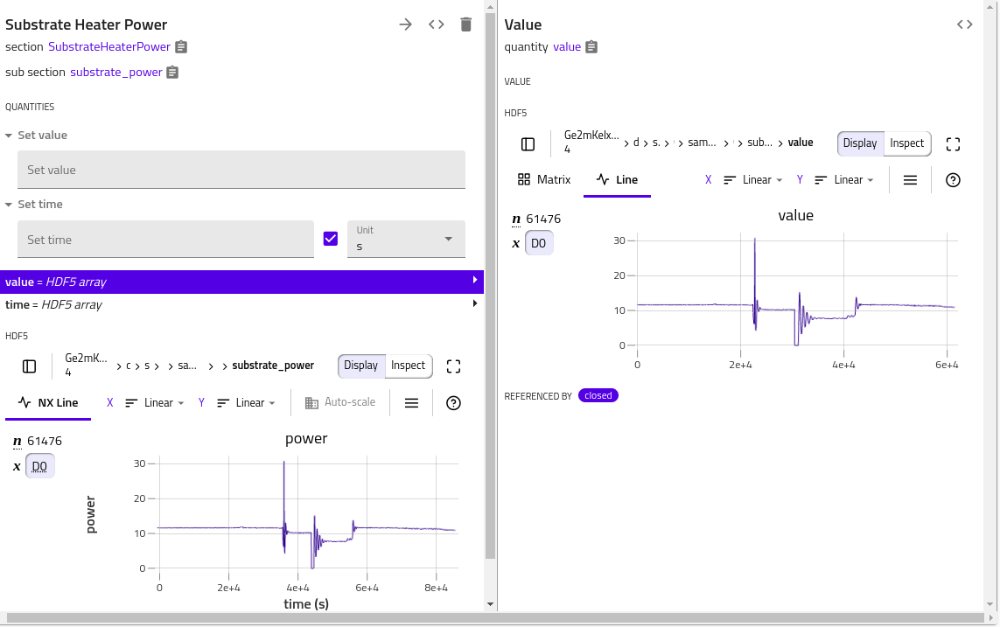

# How to use HDF5 to handle large quantities

The NOMAD schemas and processed data system are designed to describe and manage
intricate hierarchies of connected data. This is ideal for metadata and lots of small
data quantities, but does not work for large quantities. Quantities are atomic and
are always managed as a whole; there is currently no functionality to stream or
splice large quantities. Consequently, tools that produce or work with such data
cannot scale.

To address the issue, the option to use auxiliary storage systems optimized for large
data is implemented. In the following we discuss two quantity types to enable the writing
of large datasets to HDF5: `HDF5Reference` and `HDF5Dataset`. These are defined in
`nomad.datamodel.hdf5`. Another class called `HDF5Normalizer` defined in
`nomad.datamodel.metainfo.basesections` can be inherited
[and used directly in a yaml schema](basics.md#hdf5normalizer).

## HDF5Reference

HDF5Reference is a metainfo quantity type intended to reference datasets in external raw
HDF5 files. It is assumed that the dataset exists in an HDF5 file and the reference
is assigned to this quantity. Static methods to read from and write to an HDF5 file are
implemented. The following example illustrates how to use these.

```python
from nomad.datamodel import ArchiveSection
from nomad.datamodel.hdf5 import HDF5Reference

class LargeData(ArchiveSection):
    value = Quantity(type=HDF5Reference)
```

The writing and reading of quantity values to and from an HDF5 file occur during
processing. For illustration purposes, we mock this by creating `ServerContext`. Furthermore,
we use this section definition for the `data` sub-section of EntryArchive.

```python
import numpy as np

from nomad.datamodel import EntryArchive, EntryMetadata
from nomad.datamodel.context import ServerContext
from nomad.files import StagingUploadFiles
from nomad.processing import Upload

upload_files = StagingUploadFiles(upload_id='test_upload', create=True)
upload = Upload(upload_id='test_upload')
upload_files.add_rawfiles('external.h5')
context = ServerContext(upload=upload)

archive = EntryArchive(
    m_context=context,
    metadata=EntryMetadata(upload_id=upload.upload_id, entry_id='test_entry'),
    data=LargeData(),
)

data = np.eye(3)
path = 'external.h5#path/to/data'
HDF5Reference.write_dataset(archive, data, path)
archive.data.value = path
HDF5Reference.read_dataset(archive, path)
array([[1., 0., 0.],
       [0., 1., 0.],
       [0., 0., 1.]])
```

We use `write_dataset` to write our data into a raw HDF5 file in `test_upload` with the
filename and dataset location in `path`. Additionally, archive is required to resolve the
upload metadata. We then assign the reference to the dataset to `value`. To reference a
file in another upload, follow the same form for
[reference values](basics.md#different-forms-of-references) e.g.
`/uploads/<upload_id>/raw/large_data.hdf5#group/large_field`.

!!! important
    When reassigning a different value for an HDF5 archive quantity, it is necessary that the data
    attributes (shape and type) are preserved.

To read a dataset, use `read_dataset` and provide a reference. This will return the value
cast in the type of the dataset.

## HDF5Dataset

To use HDF5 storage for archive quantities, one should use `HDF5Dataset`.

```python
from nomad.datamodel.hdf5 import HDF5Dataset

class LargeData(ArchiveSection):
    value = Quantity(type=HDF5Dataset)
```

The assigned value will also be written to the archive HDF5 file and serialized as
`/uploads/test_upload/archive/test_entry#/data/value`.

To read the dataset, one shall use the context manager `with` to ensure the file is closed properly when done.

```python
archive.data.value = np.ones(3)

serialized = archive.m_to_dict()
serialized['data']['value']
# '/uploads/test_upload/archive/test_entry#/data/value'

deserialized = archive.m_from_dict(serialized, m_context=archive.m_context)
with deserialized.data.value as dataset:
    print(dataset[:])
# array([1., 1., 1.])
```

It is possible to assign to an archive quantity an array or another archive quantity.
In the second case, the dataset created in the HDF5 file will contain a link and not a copy of the array:

```python
from nomad.datamodel.hdf5 import HDF5Dataset

class LargeData(ArchiveSection):
    value_1 = Quantity(type=HDF5Dataset)
    value_2 = Quantity(type=HDF5Dataset)
```

```python
archive.data.value_1 = np.ones(3)

archive.data.value_2 = archive.data.value_1
```

## Visualizing archive HDF5 quantities

NOMAD clients (e.g. NOMAD UI) can pick up on these HDF5 serialized quantities and
provide respective functionality (e.g. showing a H5Web view).

<figure markdown>
  
  <figcaption>Visualizing archive HDF5 reference quantity using H5Web.</figcaption>
</figure>

When multiple quantities need to be displayed in the same plot, some attributes in the HDF5 file groups are needed, in order for h5web to be able to render a plot.
The [H5WebAnnotation class](../../reference/annotations.md#h5web) contains the attributes to be included in the groups (dataset) of HDF5 file, provided as section (quantity) annotations.

In the following example, the `value` quantity has a dedicated default h5web rendering.
Adding some annotation in the corresponding section would trigger another plot rendering, where `value` vs. `time` plot is shown. The errors to the dataset can be specified by `errors`
annotation.

```python
class MySection(ArchiveSection):

    m_def = Section(a_h5web=H5WebAnnotation(axes='time', signal='value'))

    value = Quantity(
        type=HDF5Dataset,
        unit='dimensionless',
        shape=[],
        a_h5web=H5WebAnnotation(
            long_name='power',
            errors='value_e'
        ),
    )
    value_e = Quantity(
        type=HDF5Dataset
    )
    time = Quantity(
        type=HDF5Dataset,
        unit='s'
        shape=[]
    )
```

<figure markdown>
  
  <figcaption>Including attributes to HDF5 groups to have composite plots using H5Web.</figcaption>
</figure>

To include plots corresponding to sub sections, one can provide a list of the section
paths to the annotation `paths`. The following example will trigger a rendering of the plot
corresponding to the first `my_sub` section. One can also use wildcards `*` to include
all sub sections and `**` to recursively search sub sections.

```python
class MySubSection(ArchiveSection):

    m_def = Section(a_h5web=H5WebAnnotation(axes='x', signal='y'))

    x = Quantity(
        type=HDF5Reference
    )

    y = Quantity(
        type=HDF5Reference
    )

class MySection(ArchiveSection):

    m_def = Section(a_h5web=H5WebAnnotation(paths=['my_sub/0']))

    my_sub = SubSection(sub_section=MySubSection, repeats=True)

```

## Metadata for large quantities

!!! warning "Attention"

    This will be implemented and documented soon.
