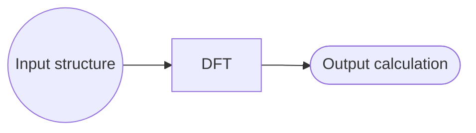
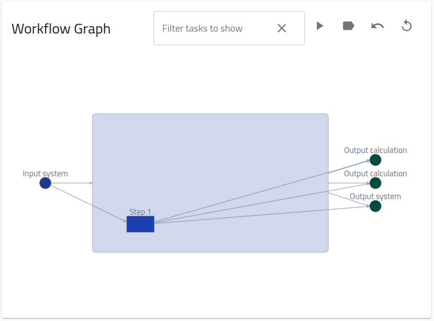
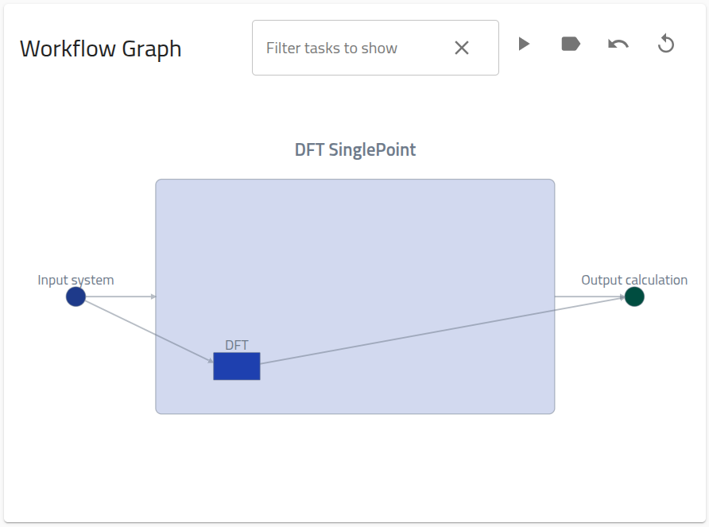
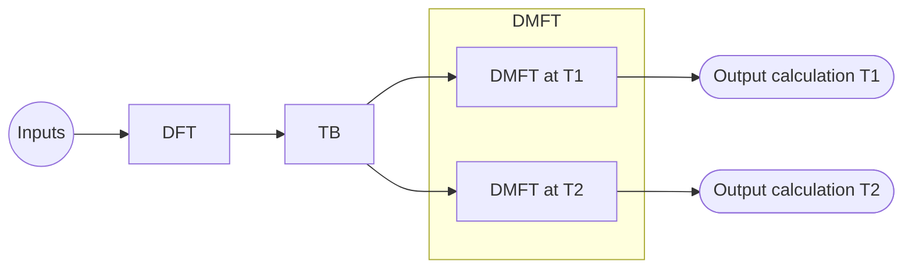
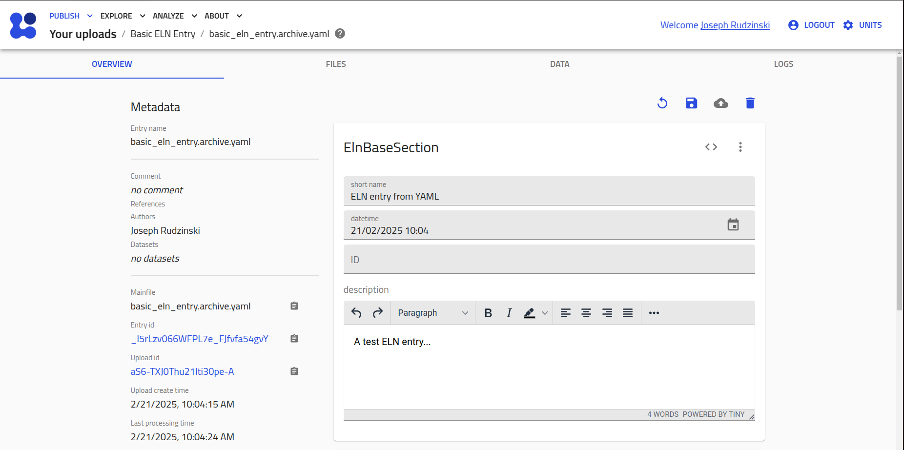
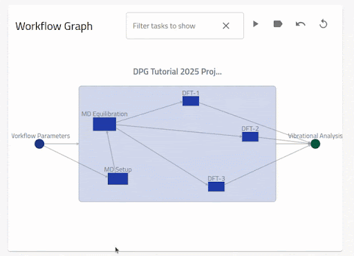

# How to define custom workflows

## What you will learn

- Connect NOMAD entries into a directed graph structure
- Create hierarchical workflow graphs
- Link task nodes to supported and custom entries (e.g., ELN entries)
- Link inputs and outputs to annotated files
- Navigate workflows using NOMAD's interactive workflow graphs

## Recommended preparation

- Basic knowledge of NOMAD Organization + MetaInfo: [Explanation > From files to data](../../explanation/basics.md), [Explanation > Data structure](../../explanation/data.md)

## Further resources

- [Tutorial > Managing workflows and projects](../../tutorial/workflows_projects.md)

## Overview

In NOMAD, [Workflows](../../explanation/workflows.md) are directed graphs with nodes (tasks) that connect multiple [Entries](../../reference/glossary.md#entry) together in a structured way, while specifying information passed between the nodes via inputs/outputs that link to particular sections of the relevant [Archive](../../reference/glossary.md#archive).

Workflows are sometimes created automatically by NOMAD during [Processing](../../explanation/processing.md), for certain supported uploads. Users can also create their own workflow entries by uploading an appropriately formatted workflow YAML. This how-to guide will cover the specifics of this process.

!!! Note
    In the following, various supported raw data files will be used to form concrete examples that can be reproduced. The nature of these files or their underlying methods of production is irrelevant for the purpose of this how-to.

## Simple workflows with supported tasks

We start with the simplest possible workflow structure&mdash;a single task with one input and one output:



The file associated with this task, `dft.xml`, is a standard DFT calculation that is supported by NOMAD's simulation parsers, i.e., upon upload it will be automatically recognized and parsed to create an entry. Actually, the parser for this file will automically create a "Single Point" workflow within the same entry, which specifies the standard input and outputs for simulation data in NOMAD:

{.screenshot}

Here, we will reproduce, and customize, this workflow graph in a separate entry, using the YAML-based approach.

To define the initial workflow, create a file `dft.workflow.archive.yaml` with the following content:

```yaml
workflow2:
  name: DFT SinglePoint
  inputs:
    - name: Input system
      section: '../upload/archive/mainfile/dft.xml#/run/0/system/-1'
  outputs:
    - name: Output calculation
      section: '../upload/archive/mainfile/dft.xml#/run/0/calculation/-1'
  tasks:
    - m_def: nomad.datamodel.metainfo.workflow.TaskReference
      task: '../upload/archive/mainfile/dft.xml#/workflow2'
      name: DFT
      inputs:
        - name: Input structure
          section: '../upload/archive/mainfile/dft.xml#/run/0/system/-1'
      outputs:
        - name: Output calculation
          section: '../upload/archive/mainfile/dft.xml#/run/0/calculation/-1'
```

!!! Warning "Important"
    For the creation of workflow entries using YAMLs, the file must have the extension `archive.yaml`.

This file is constructed according to NOMAD's schemas for [Archive Files](../../explanation/data.md#archive-files-a-shared-entry-structure) and [General Workflows](../../explanation/workflows.md#the-built-in-abstract-workflow-schema). The `workflow2` section of the archive has 3 possible subsections: `inputs`, `outputs`, and `tasks`:

**`inputs`**: a list of references to the global inputs of the workflow, with `name` and `section` attributes. `section` corresponds to a path for linking to the relevant archive section. In this case, the relative section path is `run[0].system[-1]`, linked to the entry defined by the mainfile `dft.xml`. The prefix is discussed under [Considerations for archive path specification](#path-specification).

**`outputs`**: identical to the inputs list, representing the global outputs of the workflow, with the relative section path `run[0].calculation[-1]` in this case.

**`tasks`**: a list of references to the tasks/steps of the workflow. Each task contains `m_def`, `task`, `inputs`, and `outputs` attributes. `inputs`/`outputs` are task-specific versions of the lists defined above.

`task` is the path for linking to the relevant archive section, analogous to the `section` attribute for `inputs`/`outputs`. However, this path **must** reference a task, which in all practical cases corresponds to a `workflow2` section

`m_def` defines the type of task according to NOMAD's MetaInfo schema, in this case a `TaskReference` to the archive `workflow2` section.  The use of `TaskReference` will be clarified in the [Nested workflows > In multiple entries](#in-multiple-entries) example below.

<a id="path-specification"></a>
**Considerations for archive path specification:**

- In general, the archive path can be represented as `<prefix>/<entry identifier>/<relative archive path>` (see also [How to write a YAML schema package > Different forms of references](./basics.md#different-forms-of-references)).

- The prefix for the archive path is given by: 1. `../upload/archive/mainfile` for entries that are contained within the same upload as the workflow YAML, or 2. `../uploads/<upload_id>/archive/` for entries contained in distinct uploads as the workflow YAML, where `<upload_id>` is a placeholders for the upload id, which can be obtained from the Overview page of any entry.

- The entry identifier is `<entry_id>#` (placeholder for the entry id, also found on the Overview page) for case 1 of the previous bullet, and `<path to mainfile>/<mainfile name>#` for case 2. `<path to mainfile>` is the path from the root of the original upload directory structure.

- The relative archive path is the relative path to the archive section to be linked. The archive structure can be investigated using NOMAD's [MetaInfo Browser](https://nomad-lab.eu/prod/v1/gui/analyze/metainfo/nomad.datamodel.datamodel.EntryArchive){:target="_blank"}.

With a basic understanding in hand, you can now download the example data and upload the obtained `.zip` file to NOMAD:

[Download simple_workflow.zip](data/simple_workflow.zip){ .md-button .nomad-button }

The download `simple_workflow.zip` should have the following structure:

```tree
.
├── dft.xml
├── dft.workflow.archive.yaml
```

Upon upload to NOMAD, the above zip will produce 2 entries:

1. A single point entry with mainfile `dft.xml`

2. a workflow entry with mainfile `dft.workflow.archive.yaml`. The workflow entry will contain the following workflow graph on the Overview page:

{.screenshot}

??? Tip "Adding more workflow metadata"

    You could extend the workflow metadata by adding the metholodogical input parameters. These are stored in the archive with path `run[0].method[-1]`. The new `single_point.archive.yaml` will then be:

    ```yaml
    workflow2:
      name: DFT SinglePoint
      inputs:
        - name: Input system
          section: '../upload/archive/mainfile/dft.xml#/run/0/system/-1'
        - name: Input methodology parameters
          section: '../upload/archive/mainfile/pressure1/dft_p1.xml#/run/0/method/-1'
      outputs:
        - name: Output calculation
          section: '../upload/archive/mainfile/dft.xml#/run/0/calculation/-1'
      tasks:
        - m_def: nomad.datamodel.metainfo.workflow.TaskReference
          task: '../upload/archive/mainfile/dft.xml#/workflow2'
          name: DFT
          inputs:
            - name: Input structure
              section: '../upload/archive/mainfile/dft.xml#/run/0/system/-1'
            - name: Input methodology parameters
              section: '../upload/archive/mainfile/dft.xml#/run/0/method/-1'
          outputs:
            - name: Output calculation
              section: '../upload/archive/mainfile/dft.xml#/run/0/calculation/-1'
    ```

    When uploaded with `dft.xml` as before, this will generate a similar workflow graph, but with an extra input node.

## Referencing Tasks in different uploads

As already mentioned under [Considerations for archive path specification](#path-specification), your workflow YAML can reference entries that you have previously uploaded to NOMAD. In this case, you should replace the path prefix `../upload/archive/mainfile/<mainfile_name>` with `../uploads/<upload_id>/archive/<entry_id>`.

??? Tip "Corresponding `dft.workflow.archive.yaml` from above example"

    ```yaml
    workflow2:
      name: DFT SinglePoint
      inputs:
        - name: Input system
          section: '../upload/<upload_id>/archive/<entry_id>#/run/0/system/-1'
      outputs:
        - name: Output calculation
          section: '../upload/<upload_id>/archive/<entry_id>#/run/0/calculation/-1'
      tasks:
        - m_def: nomad.datamodel.metainfo.workflow.TaskReference
          task: '../upload/<upload_id>/archive/<entry_id>#/workflow2'
          name: DFT
          inputs:
            - name: Input structure
              section: '../upload/<upload_id>/archive/<entry_id>#/run/0/system/-1'
          outputs:
            - name: Output calculation
              section: '../upload/<upload_id>/archive/<entry_id>#/run/0/calculation/-1'
    ```

## Nested workflows

Nested, or hierarchical, workflows correspond to workflow graphs containing task nodes that themselves can be represented as a directed graph, i.e., a sub-workflow. The [General Workflow Schema](../../explanation/workflows.md#the-built-in-abstract-workflow-schema) allows for nested workflows through an inheritance relationship from the `Task` class to the `Workflow` class.

### In multiple entries

The most common way to construct a nested workflow is by creating separate entries for each (sub-)workflow. In this case, each sub-workflow archive will contain a populated `workflow2` section. Thus, to add a sub-workflow to your workflow YAML, the **best practice** is to directly link to this `workflow2` section, i.e., `task: <prefix>/<entry identifier>/workflow2`.

!!! Warning "Important"
    When `task` is linked to a `workflow2` section of a different upload, this sub-workflow task **must** be defined as a `TaskReference` by setting `m_def: nomad.datamodel.metainfo.workflow.TaskReference`. This is necessary to overwrite the default class for `workflow2.task`, `nomad.datamodel.metainfo.workflow.Task`, which is only allowed to contain a `Task` instance directly, but not allowed to reference one (see [General Workflow Schema](../../explanation/workflows.md#the-built-in-abstract-workflow-schema)).

We have already seen this case in [Simple Workflows with Support Tasks](#simple-workflows-with-supported-tasks). Actually, there is a convention in NOMAD that all simulation entries contain a workflow representation, even for single-step workflows. Thus, any workflow containing simulation tasks will be a nested workflow.

### In a single entry

Since a `Workflow` instance is also a `Task` instance due to inheritance, we can directly nest workflows within a single entry. Here we illustrate the concept using a concrete computational workflow, represented schematically as:



This workflow contains a series of electronic structure calculations: a DFT and a TB calculation performed in serial, followed by two DMFT calculations performed in parallel at two different temperatures. The DMFT workflow task is considered as a sub-workflow.

The mainfiles for these calculations are organized in the following file structure, stored with `nested_workflow_one-entry.zip`:

```tree
.
├── DFT
│   └── dft.xml
├── TB
│   ├── tb.wout
│   └── ...extra auxiliary files
├── DMFT
    ├── T1
    │    └── dmft_t1.hdf5
    └── T2
        └── dmft_t2.hdf5
```

We construct the YAML, `nested_workflow_one-entry.archive.yaml` in parts for clarity:

The overall `workflow2` section and global workflow `inputs`:

```yaml
workflow2:
  name: DFT+TB+DMFT
  inputs:
    - name: Input structure
      section: '../upload/archive/mainfile/DFT/dft.xml#/run/0/system/-1'
```

The global workflow outputs `outputs`:

```yaml
  outputs:
    - name: Output DMFT at T1 calculation
      section: '../upload/archive/mainfile/DMFT/T1/dmft_t1.hdf5#/run/0/calculation/-1'
    - name: Output DMFT at T2 calculation
      section: '../upload/archive/mainfile/DMFT/T2/dmft_t2.hdf5#/run/0/calculation/-1'
```

The workflow `tasks`:

```yaml
  tasks:
    - m_def: nomad.datamodel.metainfo.workflow.TaskReference
      task: '../upload/archive/mainfile/DFT/dft.xml#/workflow2'
      name: DFT
      inputs:
        - name: Input structure
          section: '../upload/archive/mainfile/DFT/dft.xml#/run/0/system/-1'
      outputs:
        - name: Output DFT calculation
          section: '../upload/archive/mainfile/DFT/dft.xml#/run/0/calculation/-1'
    - m_def: nomad.datamodel.metainfo.workflow.TaskReference
      task: '../upload/archive/mainfile/TB/tb.wout#/workflow2'
      name: TB
      inputs:
        - name: Input DFT calculation
          section: '../upload/archive/mainfile/DFT/dft.xml#/run/0/calculation/-1'
      outputs:
        - name: Output TB calculation
          section: '../upload/archive/mainfile/TB/tb.wout#/run/0/calculation/-1'
    - m_def: nomad.datamodel.metainfo.workflow.Workflow
      name: DMFT
      inputs:
        - name: input TB calculation
          section: '../upload/archive/mainfile/TB/tb.wout#/run/0/calculation/-1'
      outputs:
        - name: Output DMFT at T1 calculation
          section: '../upload/archive/mainfile/DMFT/T1/dmft_t1.hdf5#/run/0/calculation/-1'
        - name: Output DMFT at T2 calculation
          section: '../upload/archive/mainfile/DMFT/T2/dmft_t2.hdf5#/run/0/calculation/-1'
      tasks:
        - m_def: nomad.datamodel.metainfo.workflow.TaskReference
          task: '../upload/archive/mainfile/DMFT/T1/dmft_t1.hdf5#/workflow2'
          name: DMFT at T1
          inputs:
            - name: Input TB calculation
              section: '../upload/archive/mainfile/TB/tb.wout#/run/0/calculation/-1'
          outputs:
            - name: Output DMFT at T1 calculation
              section: '../upload/archive/mainfile/DMFT/T1/dmft_t1.hdf5#/run/0/calculation/-1'
        - m_def: nomad.datamodel.metainfo.workflow.TaskReference
          task: '../upload/archive/mainfile/DMFT/T1/dmft_t1.hdf5#/workflow2'
          name: DMFT at T2
          inputs:
            - name: Input TB calculation
              section: '../upload/archive/mainfile/TB/tb.wout#/run/0/calculation/-1'
          outputs:
            - name: Output DMFT at T2 calculation
              section: '../upload/archive/mainfile/DMFT/T2/dmft_t2.hdf5#/run/0/calculation/-1'
```

Most importantly for this example: In contrast to [Nested workflows > In multiple files](#in-multiple-entries), where `TaskReference` was used to define sub-workflows, the task named `DMFT` is defined directly as type `Workflow`.

When uploaded with the example data, this workflow file will produce an entry with the following nested workflow graph on the Overview page:

<video width="100%" controls>
  <source src="./images/nested_workflow_one-entry.webm" alt="" type="video/mp4">
</video>

You can reproduce this example by downloading the example data (with workflow YAML included at the root level), and uploading to NOMAD yourself:

[Download nested_workflow_one-entry.zip](data/nested_workflow_one-entry.zip){ .md-button .nomad-button }

## Workflows with custom tasks

*custom tasks:* defined here as tasks for which the corresponding raw files are not automatically recognized by NOMAD, or perhaps there are no raw files at all for the task.

The easiest way to create entries for a custom task is to use one of NOMAD's built-in ELN schemas. ELN entries can be created from these schema using the user interface: [How to > Manage > Create a basic ELN entry](../manage/eln.md#create-a-basic-eln-entry).

### Creating an ELN entry from YAML

Analogous to the simulation code parsers, NOMAD has a parser for its native schema &mdash; the NOMAD MetaInfo. This parser is automatically executed for files named `<file_name>.archive.yaml` (see the Note under [Explanation > From files to data > Parsing](../../explanation/basics.md#parsing)). Actually, this is exactly the functionality that we are using to upload our workflows.

In this way, users can also create ELN entries, by uploading a YAML file populated according to one of NOMAD's ELN built-in schemas. For example, we can create a basic ELN entry by creating and uploading a file, e.g. `basic_eln_entry.archive.yaml`, with the contents:

```yaml
data:
  m_def: "nomad.datamodel.metainfo.eln.ElnBaseSection"
  name: "ELN entry from YAML"
  description: "A test ELN entry..."
```

The `data` section is created and defined as type `ElnBaseSection`, meaning that we can populate all the quantities (e.g., name and description) living in this section (as seen in [MetaInfo Browser > ELNBaseSection](https://nomad-lab.eu/prod/v1/gui/analyze/metainfo/nomad/section_definitions@nomad.datamodel.metainfo.eln.ElnBaseSection){:target="_blank"}).

Uploading this yaml to the test deployment results in an entry with the overview page:

<div class="click-zoom">
    <label>
        <input type="checkbox">
        
    </label>
</div>

### The `ELNFileManager`

`ELNFileManager` is a built-in schema for referencing and annotating files within an ELN entry. You can create an `ELNFileManager` either from the GUI or via the YAML approach, in the same ways as described above.

For example:

<h4><code>create_force_field.archive.yaml</code></h4>
```yaml
data:
  m_def: 'nomad.datamodel.metainfo.eln.ElnFileManager'
  name: 'Create force field'
  description: 'The force field is defined for input to the MD simulation engine.'
  Files:
  - file: 'water.top'
    description: 'The force field file for simulation input.'
```

Uploading to NOMAD with an empty dummy file called `water.top` should result in the following entry display:

<video width="100%" controls>
  <source src="./images/ELNFileManager.webm" alt="" type="video/mp4">
</video>

### Example workflow with ELN tasks

For a concrete example, consider the following workflow consisting of 3 tasks for setting up a molecular dynamics simulation. Each task has as input some parameters and an execution script, and outputs some file:

<video width="100%" controls>
  <source src="./images/md-setup-workflow.webm" alt="MD Setup Workflow" type="video/mp4">
</video>

Use the `ELNFileManager` class to create entries for each task, as well as for the workflow parameters and execution scripts:

??? success "`create_force_field.archive.yaml`"

    ```yaml
    data:
      m_def: 'nomad.datamodel.metainfo.eln.ElnFileManager'
      name: 'Create force field'
      description: 'The force field is defined for input to the MD simulation engine.'
      Files:
      - file: 'Custom_ELN_Entries/water.top'
        description: 'The force field file for simulation input.'
    ```

??? success "`create_box.archive.yaml`"

    ```yaml
    data:
      m_def: 'nomad.datamodel.metainfo.eln.ElnFileManager'
      name: 'Create box'
      description: 'The initial simulation box is created.'
      Files:
      - file: 'Custom_ELN_Entries/box.gro'
        description: 'An empty structure file with the box vectors.'
    ```

??? success "`insert_water.archive.yaml`"

    ```yaml
    data:
      m_def: 'nomad.datamodel.metainfo.eln.ElnFileManager'
      name: 'Insert water'
      description: 'Water is inserted into the simulation box, creating the structure file for simulation input.'
      Files:
      - file: 'Custom_ELN_Entries/water.gro'
        description: 'The structure file for simulation input.'
    ```

??? success "`workflow_parameters.archive.yaml`"

    ```yaml
    data:
      m_def: nomad.datamodel.metainfo.eln.ElnBaseSection
      name: 'Workflow Parameters'
      description: 'This is a description of the overall workflow parameters, or alternatively standard workflow specification...'
    ```

??? success "`workflow_scripts.archive.yaml`"

    ```yaml
    data:
      m_def: 'nomad.datamodel.metainfo.eln.ElnFileManager'
      name: 'Workflow Scripts'
      description: 'All the scripts run during setup of the MD simulation.'
      Files:
      - file: 'Custom_ELN_Entries/workflow_script_1.py'
        description: 'Creates the simulation box and inserts water molecules.'
      - file: 'Custom_ELN_Entries/workflow_script_2.py'
        description: 'Creates the appropriate force field files for the simulation engine.'
    ```

Now we construct the workflow YAML, `setup_workflow.archive.yaml`, as in the examples above:

??? success "`setup_workflow.archive.yaml`"

    ```yaml
    "workflow2":
      "name": "MD Setup workflow"
      "inputs":
      - "name": "workflow parameters"
          "section": "../upload/archive/mainfile/Custom_ELN_Entries/workflow_parameters.archive.yaml#/data"
      - "name": "workflow scripts"
          "section": "../upload/archive/mainfile/Custom_ELN_Entries/workflow_scripts.archive.yaml#/data/Files"
      "outputs":
      - "name": "structure file"
          "section": "../upload/archive/mainfile/Custom_ELN_Entries/insert_water.archive.yaml#/data/Files/0/file"
      - "name": "force field file"
          "section": "../upload/archive/mainfile/Custom_ELN_Entries/create_force_field.archive.yaml#/data/Files/0/file"
      "tasks":
      - "m_def": "nomad.datamodel.metainfo.workflow.TaskReference"
          "name": "create box"
          "task": "../upload/archive/mainfile/Custom_ELN_Entries/create_box.archive.yaml#/data"
          "inputs":
          - "name": "workflow parameters"
          "section": "../upload/archive/mainfile/Custom_ELN_Entries/workflow_parameters.archive.yaml#/data"
          - "name": "workflow script 1"
          "section": "../upload/archive/mainfile/Custom_ELN_Entries/workflow_scripts.archive.yaml#/data/Files/0/file"
          "outputs":
          - "name": "initial box"
          "section": "../upload/archive/mainfile/Custom_ELN_Entries/create_box.archive.yaml#/data/Files/0/file"
      - "m_def": "nomad.datamodel.metainfo.workflow.TaskReference"
          "name": "insert water"
          "task": "../upload/archive/mainfile/Custom_ELN_Entries/insert_water.archive.yaml#/data"
          "inputs":
          - "name": "initial box"
          "section": "../upload/archive/mainfile/Custom_ELN_Entries/create_box.archive.yaml#/data/Files/0/file"
          - "name": "workflow script 1"
          "section": "../upload/archive/mainfile/Custom_ELN_Entries/workflow_scripts.archive.yaml#/data/Files/0/file"
          "outputs":
          - "name": "structure file"
          "section": "../upload/archive/mainfile/Custom_ELN_Entries/insert_water.archive.yaml#/data/Files/0/file"
      - "m_def": "nomad.datamodel.metainfo.workflow.TaskReference"
          "name": "create force field"
          "task": "../upload/archive/mainfile/Custom_ELN_Entries/create_force_field.archive.yaml#/data"
          "inputs":
          - "name": "workflow parameters"
          "section": "../upload/archive/mainfile/Custom_ELN_Entries/workflow_parameters.archive.yaml#/data"
          - "name": "workflow script 2"
          "section": "../upload/archive/mainfile/Custom_ELN_Entries/workflow_scripts.archive.yaml#/data/Files/1/file"
          "outputs":
          - "name": "force field file"
          "section": "../upload/archive/mainfile/Custom_ELN_Entries/create_force_field.archive.yaml#/data/Files/0/file"
    ```

To reproduce the workflow shown in the video above, download the example files, entry YAMLs, and workflow YAML defined above, and upload them to NOMAD:

[Download Custom_ELN_Entries.zip](data/Custom_ELN_Entries.zip){ .md-button .nomad-button }

## Referencing ELN entries created with the GUI

To reference ELN entries created using the NOMAD GUI, use the upload and entry ids for the archive path specification, as detailed in [Referencing Tasks in Different Uploads](#referencing-tasks-in-different-uploads) above.

## Creating workflow graphs with the GUI using the ELN interface

<!-- TODO - Add example, possibly from Tutorial 16? -->

!!! Warning

    Coming soon ...

<!-- TODO - also ensuring connections in the workflow visualizer! Somewhere -->
## Using the workflow visualizer

As we have seen above, when a workflow is defined within an entry, The Overview page will show an interactive graph of the `workflow2` section defined.
The following video demonstrates the basic navigation functionalities of these interactive workflow graphs:

{.screenshot}

The nodes (inputs, tasks and outputs) are shown from left to right for the current workflow layer.
The edges (arrows) from (to) a node denotes an input (output) to a section in the target node.
One can see the description for the nodes and edges by hovering over them. When the
inputs and outputs are clicked, the linked section is shown in the archive browser. By clicking
on a task, the graph zooms into the nested workflow layer. By clicking on the arrows,
only the relevant linked nodes are shown. One can go back to the previous view by clicking on
the current workflow node.

A number of controls are also provided on top of the graph. The first enables a filtering
of the nodes following a python-like syntax i.e., list (comma-separated) or range (colon-separated).
Negative index and percent are also supported. By default, the task nodes can be filtered
but can be changed to inputs or outputs by clicking on one of the respective nodes. By clicking
on the `play` button, a force-directed layout of the task nodes is enabled. The other tools
enable to toggle the legend, go back to a previous view and reset the view.

You can also use the graph to navigate to the referenced data, by clicking the labels above any task node or input/output, as shown in the following video:

<video width="100%" controls>
  <source src="./images/ELNFileManager.webm" alt="" type="video/mp4">
</video>

Once you leave the workflow entry, you can use either the browser back button or, more generally, the "Entry References" section of the Overview page to navigate back to the workflow entry:

<!-- TODO Add a video of navigating via the references at the bottom of the page. -->

!!! Warning

    Illustrative video coming soon ...

!!! Tip "Proper creation of workflow entries"

    <!-- ! add tips for creating the visualization properly -->

    To ensure that the workflow visualizer functions correctly:

      - To create a graph edge, at least one `input` of the in-node must match exactly an `output` of the out-node.
<!-- TODO Add more tips -->

## Advanced Topics

### Instantiating a workflow from YAML using a standardized workflow class

!!! Warning

    Coming soon ...

### Extending the workflow schema

<!-- TODO Possibly update this example, and maybe define the scope of usage -->

The abstract workflow schema above allows us to build generalized tools for workflows,
like workflow searches, navigation in workflow, graphical representations of workflows, etc. But, you can still augment the given section definitions with more information through
inheritance. These information can be specialized references to denote inputs and outputs,
can be additional workflow or task parameters, and much more.

In this example, we created a special workflow section definition `GeometryOptimization`
that defines a parameter `threshold` and an additional reference to the final
calculation of the optimization:

```yaml
definitions:
  sections:
    GeometryOptimizationWorkflow:
      base_section: nomad.datamodel.metainfo.workflow.Workflow
      quantities:
        threshold:
          type: float
          unit: eV
        final_calculation:
          type: runschema.calculation.Calculation

workflow2:
  m_def: GeometryOptimizationWorkflow
  final_calculation: '#/run/0/calculation/-1'
  threshold: 0.029
  name: GeometryOpt
  inputs:
    ...
```
