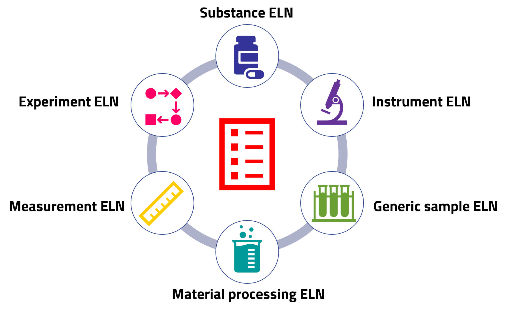
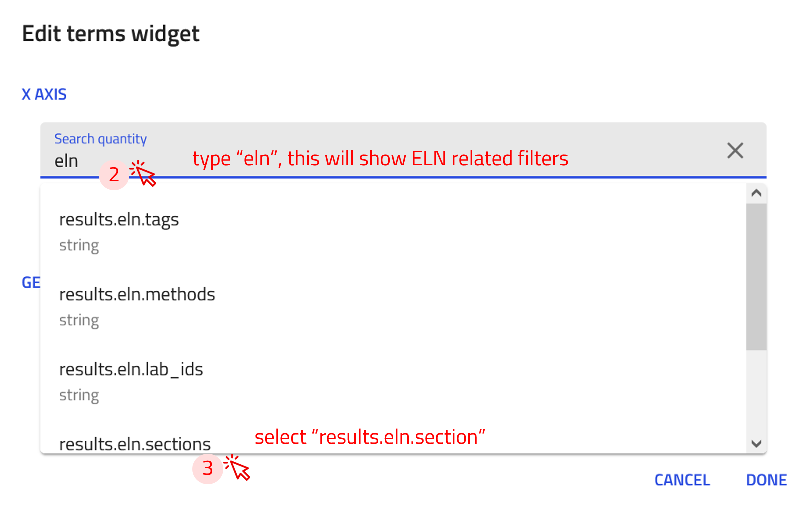

# Using NOMAD as an Electronic Lab Notebook

In this tutorial, we will explore how to use NOMAD's Electronic Lab Notebook (ELN) functionality to record experiments effectively. You will learn how to create entries for substances and instruments, record samples along with their processing conditions, and the various measurements that make up your experiments. We will also cover NOMAD's built-in ELN templates, which help structure and interlink different aspects of an experiment, providing a clear, visual overview of the entire workflow.

In doing this, we will apply an example of an experiment on preparing solution-processed polymer thin-films and measuring their optical absorption spectrum.

??? example "About the example experiment used for this exercise"
    In this exercise, we will work with an example experiment involving the preparation and characterization of Poly(3-hexylthiophene-2,5-diyl) ("P3HT") thin films. The experiment consists of three main activities: preparing solutions, depositing thin films, and measuring optical absorption.

    1. **Preparing solutions:** The polymer powder is mixed with a solvent in predefined quantities to achieve the desired concentration. A scale is used to accurately weigh the polymer powder, ensuring precise solution concentration.

    2. **Depositing thin-films:** The prepared solution is used to create a thin film on a glass substrate through spin-coating. By carefully controlling the spin speed and duration, the desired film thickness is achieved.

    3. **Measuring optical absorption:** The optical absorption spectrum of the thin film is acquired using a UV-Vis-NIR spectrometer. The measurement results are saved as a .csv file for further analysis.

    To effectively document this experiment, we will create and interlink electronic lab notebook (ELN) entries in NOMAD. These entries will include key entities such as substances, instruments, and samples, as well as activities like material processing and measurements. By structuring the data in this way, we ensure a comprehensive and FAIR-compliant record of the experiment.

    

## Create a New ELN Upload

In NOMAD, an Electronic Lab Notebook (ELN) is created by initiating a NOMAD upload. This process allows you to structure and document your research data efficiently. For a step-by-step guide on how to create an upload, please refer to [this page](upload_publish.md#create-new-upload){:target="_blank"}.

## Create ELN Entries

The next step is to create entries for your substances, instruments, processes, and measurements. In NOMAD, each ELN entry is structured using templates called *built-in schema*. These templates are specifically designed to capture relevant information for different types of entries, ensuring consistency and completeness in documentation.

They include general fields tailored to the type of entry you are creating. The currently available ELN built-in schemas in NOMAD are illustrated in the figure below.

To create ELN entries using the templates provided by NOMAD, we will generate instances from the built-in schemas. This will automatically create entries with predefined fields, allowing us to efficiently fill in the relevant information of our experiment.

**Use the arrow buttons ⬅️➡️ below to follow the steps for creating ELN entries using the built-in schema.**

    
←

    
    
    
    
    
→

### Create a Substance Entry

Now, let's create an entry using the built-in *Substance ELN* schema for **P3HT powder**. Follow the steps of creating an entry described above and select *Substance ELN* from the drop-down menu in step 4.

    

??? info "Input fields offered by the built-in schema *Substance ELN*"
    The built-in schema *Substance ELN*  provides the following fields for input:

    - **substance name:** Automatically used as the entry name.
    - **tags:** User selected tags to improve searchability.
    - **datetime:** Allows entry of a date/time stamp.
    - **substance ID:** A unique, human-readable ID for the substance.
    - **detailed substance description:** A free text field for additional information.

    Additional subsections available in the *data* subsection include:

    - **elemental composition:** Define the chemical composition with atomic and mass fractions.
    - **pure substance:** Specify if the material is a pure substance purchased from an external vendor, with fields like:
        - Substance name
        - IUPAC name
        - Molecular formula
        - CAS number
        - Inchi Key, SMILES, and more.
    - **substance identifier:** Add identifiers for specific substances.

Once the entry is created, we can fill in the relevant fields with detailed and accurate information. Fields can also be updated as needed to keep the entry accurate and useful.

**Use the arrow buttons ⬅️➡️ below to follow the steps for filling in a substance entry.**

    
←

    
    
    
    
    
    
    
→

??? task "Task: Create an ELN entry for substances"
    Create an ELN entry in NOMAD for the following substances:

    - Chloroform
    - Glass substrate

    Use the *Substance ELN* schema and include as many details as you like (e.g., Substance Name, Datetime, Substance ID, Description).

---

### Create a Sample Entry

Now, let's create an entry using the built-in *Generic Sample ELN* schema for **P3HT Thin Film**. Follow the steps of creating an entry described above and select *Generic Sample ELN* from the drop-down menu in step 4.

    

??? info "Input fields offered by the built-in schema *Generic Sample ELN*"
    The built-in schema *Generic Sample ELN* provides the following fields for input:

    - **name:** Automatically used as the entry name.
    - **tags:** User selected tags to improve searchability.
    - **datetime:** Allows entry of a date/time stamp.
    - **ID:** A unique, human-readable ID for the sample.
    - **description:** A free text field for additional information.

    Additional subsections available in the *data* subsection include:

    - **elemental composition:** Define the chemical composition with atomic and mass fractions.
    - **components:** Specify the components used to create the sample, including raw materials or system components.
    - **sample identifier:** Add unique identifiers for the sample.

Once the entry is created, we can fill in the relevant fields with detailed and accurate information. Fields can also be updated as needed to keep the entry accurate and useful.

**Use the arrow buttons ⬅️➡️ below to follow the steps for filling in a sample entry.**

    
←

    
    
    
    
    
    
    
→

??? task "Task: Create an ELN entry for a sample"

    Create an ELN entry in NOMAD for P3HT solution in chloroform.
    Reference the sample to its components (P3HT powder and chloroform).

    Use the *Generic Sample ELN* schema and include as many details as you like (e.g., Short Name, Datetime, ID, Description).

---

### Create an Instrument Entry

Now, let's create an entry using the built-in *Instrument ELN* schema for **scale**. Follow the steps of creating an entry described above and select *Instrument ELN* from the drop-down menu in step 4.

    

??? info "Input fields offered by the built-in schema *Instrument ELN*"
    The built-in schema *Instrument ELN* provides the following fields for input:

    - **name:** Automatically used as the entry name.
    - **tags:** User selected tags to improve searchability.
    - **datetime:** Allows entry of a date/time stamp.
    - **ID:** A unique, human-readable ID for the.
    - **description:** A free text field for additional information.

    Additional subsections available in the *data* subsection include:

    - **instrument identifiers:** Specify the type of instrument and additional metadata, if applicable.

Once the entry is created, we can fill in the relevant fields with detailed and accurate information. Fields can also be updated as needed to keep the entry accurate and useful.

**Use the arrow buttons ⬅️➡️ below to follow the steps for filling in an instrument entry.**

    
←

    
    
    
→

??? task "Task: Create an ELN entry for an instrument"
    Create an ELN entry in NOMAD for one of the following instruments:

    - Optical Spectrometer
    - Spin Coater

    Use the *Instrument ELN* schema and include as many details as you like (e.g., name, datetime, ID, description).

---

### Create a Process Entry

Now, let's create an entry using the built-in *Material Processing ELN* schema for **Preparation of P3HT solution**. Follow the steps of creating an entry described above and select *Materials Processing ELN* from the drop-down menu in step 4.

    

??? info "Input fields offered by the built-in schema *Material Processing ELN*"
    The *Material Processing ELN* schema provides the following fields for input:

    - **name:** Automatically used as the entry name.
    - **starting time and ending time:** Allows entry of a date/time stamp for the process duration.
    - **tags:** User selected tags to improve searchability.
    - **ID:** A unique, human-readable ID for the process.
    - **location:** A text field specifying the location where the process took place.
    - **description:** A free text field for additional information about the process.

    Additional subsections available in the *data* subsection include:

    - **steps:** Define the step-by-step procedure for the material processing.
    - **process identifier:** Add unique identifiers for the process.
    - **instruments:** List the instruments used in the process.
    - **samples:** Specify the samples that are created or used in the process.

Once the entry is created, we can fill in the relevant fields with detailed and accurate information. Fields can also be updated as needed to keep the entry accurate and useful.

**Use the arrow buttons ⬅️➡️ below to follow the steps for filling in a material processing entry.**

    
←

    
    
    
    
    
    
    
→

??? task "Task: Reference a sample to your process ELN"
    For the Process ELN entry created above, make a reference to a sample entry called *P3HT_solution_in_CF*.

    - If the P3HT_solution_in_CF sample entry already exists, simply link to it within the samples subsection of your Process ELN entry.
    - If the sample entry does not exist, first create a Sample ELN entry named P3HT_solution_in_CF, then add the reference in the Process ELN entry.

**Defining the steps of a process**

The *steps* subsection in the *Materials Processing ELN* allows us to document each stage of the process and visualize them in an interactive workflow graph.

For the example process entry **Preparation of P3HT solution**, we will define the following three steps:

1. weighing the powder
2. filling the solvent
3. mixing the solution

**Use the arrow buttons ⬅️➡️ below to follow the steps for defining the process stages in your material processing entry.**

    
←

    
    
    
    
    
→

Note that the added information in the **subsections** will be used to automatically fill in the Workflow graph as **tasks**, as well as **the References section**. You can find the Workflow Graph the in **OVERVIEW** tab of the entry.

    

The workflow graph can be modified and enriched by adding additional information such as **inputs**, **additional tasks**, and **outputs** for each step. You can do this in the **workflow2** section.

The **workflow2** section of the **Preparation of P3HT solution** example can be found under the **DATA** tab, in the left panel under **workflow2**. We can now add inputs, by referencing existing substance entries.

**Use the arrow buttons ⬅️➡️ below to follow the steps for editing the workflow graph.**

    
←

    
    
    
    
    
→

??? task "Task: Reference P3HT powder as input for the process"
    For the Process ELN entry created above, make reference to the substance ELN entry *P3HT Powder* as an input of the process.

    *Tip:* Use the workflow2 section of the entry.

We can now see the changes in the workflow graph based on our modifications in the workflow section.

    

---

### Create a Measurement Entry

Now, let's create an entry using the built-in *Measurement ELN* schema for **Optical absorption measurement**. Follow the steps of creating an entry described above and select *Measurement ELN* from the drop-down menu in step 4.

    

??? info "Input fields offered by the built-in schema *Measurement ELN*"
    - **name:** Automatically used as the entry name.
    - **starting time** Allows entry of a date/time stamp for the measurement.
    - **tags:** User selected tags to improve searchability.
    - **ID:** A unique, human-readable ID for the process.
    - **location:** A text field specifying the location where the process took place.
    - **description:** A free text field for additional information about the process.

    Additional subsections available in the *data* subsection include:

    - **steps:** Define the step-by-step procedure for the material processing.
    - **samples:** Specify the samples that are being measured.
    - **measurement identifier:** Add unique identifiers for the measurement.
    - **instruments:** List the instruments used in the measurement.
    - **results:** Provide information about the results of the measurements (text and images).

Once the entry is created, we can fill in the relevant fields with detailed and accurate information. Fields can also be updated as needed to keep the entry accurate and useful.

**Use the arrow buttons ⬅️➡️ below to follow the steps for filling in a measurement entry.**

    
←

    
    
    
    
    
    
    
    
    
→

---

### Integrate Your Experiment

Once all substances, samples, processes, and measurements are defined, you can integrate them into a structured workflow using the *Experiment ELN* schema. The *Experiment ELN* schema allows linking *processes* and *measurements* into a single entry for a comprehensive overview of your experimental workflow.

To create an entry using the built-in *Experiment ELN* schema for **Characterization of P3HT**. Follow the steps of creating an entry described above and select *Experiment ELN* from the drop-down menu in step 4.

    

??? info "Input fields offered by the built-in schema *Experiment ELN*"
    - **name:** Automatically used as the entry name.
    - **starting time** Allows entry of a date/time stamp for the measurement.
    - **tags:** User selected tags to improve searchability.
    - **ID:** A unique, human-readable ID for the process.
    - **location:** A text field specifying the location where the process took place.
    - **description:** A free text field for additional information about the process.

    Additional subsections available in the *data* subsection include:

    - **steps:** Define the step-by-step procedure for the material processing.
    - **experiment identifiers:** Specify the additional metadata for the experiment.

The *steps* subsection allows us to reference the various processes and measurements that were part of the experiments. By organizing these elements into a structured and interactive workflow, we can provide a clearer overview of the experimental sequence, enabling better visualization and understanding of how different steps are interconnected.

    

---

## Exploring and Searching Your ELN

??? example "Download the example file for this exercise"
    We have prepared a compressed file for this task, which can be downloaded from this [link](https://github.com/FAIRmat-NFDI/FAIRmat-tutorial-16/raw/refs/heads/main/tutorial_16_materials/part_4_files/example_NOMAD_ELN.zip).

    The file contains multiple NOMAD ELN entries in `.json` format.

    These entries have been created using the NOMAD ELN built-in schema, organized into folders, and categorized with custom tags.

    You can drag and drop this file into a new upload in NOMAD to view its contents.

Imagine you have created multiple entries of substances, samples, instruments, processes, and measurements, and you need to quickly find a specific experiment or material. Instead of manually searching through files, NOMAD’s ELN allows you to search, filter, and organize your entries—saving you time and effort.

??? info "Organizing your ELN upload"
    NOMAD is a file-based system. You can access, organize, and download your files within each upload. You can also create folders to categorize entries into materials, samples, instruments, processes, and results, as well as upload additional documents, such as relevant PDFs.

    !!! warning "If you plan to organize your entries into separate folders, do so before you reference them to each other. Moving them afterward may break the reference links."

    You can follow these steps to organize your ELN entries:

    1. Navigate to the **FILES** tab in your upload. This view functions like a file explorer, allowing you to view and manage files.
    

    
    

    2. Add new folders and organize them according to your needs.
    

        
    

    3. Drag and drop files into the desired folder. A prompt will appear, asking if you want to copy or move the files—choose according to your needs.
    

        
    

    4. Once all files are sorted, take a moment to review the structure. Here’s an example of an organized ELN
    

        
    

**Searching your ELN entries**

To search for entries in your ELN, follow these steps:

1. on the top of the ELN upload page, click on the  icon.

    

2. From the drop-down menu, select *Entries*.

    

    This will open NOMAD's **EXPLORE** page with a filter applied to display only the entries from your upload.

    

On the **EXPLORE** page, you can use the filter options in the sidebar to refine your search, enter specific keywords in the search bar to find relevant entries, or create custom widgets to visualise your ELN data.

??? info "Filtering entries in NOMAD"
    NOMAD provides various filters that can be used to efficiently find your ELN entries, but the following two filters are particularlly effective:

    - Filter by built-in schema used to create the entry.

        *For example, ELNInstrument, ELNSubstances, ELNSample, etc.*

    - Filter by custom tags, where you assign common tags to related entries for easy grouping.

        *For example, tag all solvents as "my_solvent" or all samples as "my_samples".*

    Using these filters helps you quickly locate specific entries in your ELN.

**Customize your search interface with widgets**

Widgets allow you to customize your search interface to better suit your data exploration needs. By adding and rearranging widgets, you can create a personalized view that highlights the most relevant filters, metadata, or visualizations most relevant to your research.

??? task "Create a custom widget for ELN sections and custom tags"
    To create a custom widget for filtering your ELN, follow these steps:

    1. Click on the `+ TERMS` button to open the *Edit terms widget* menu.

    

        
    

    2. In the *Search quantity* field, type *eln*. A list of available filters will appear.

    3. Select `results.eln.sections` from the list. This will enable filtering based on the built-in ELN sections available in your ELN upload.

    

        
    

    4. Write a descriptive title for the custom widget in *Title field*.

    5. Click DONE!

    

        
    

    The new ELN sections widget now appears at the top of your **EXPLORE** page and displays ELN entry types along with their corresponding counts.

    

        
    

    You can now follow the same steps to create a custom widget for filtering by custom tags.

    In Step 3, instead of selecting `results.eln.sections`, choose `results.eln.tags`. This will create a widget that filters your ELN entries based on the custom tags you have assigned.

    This widget will then appear on your **EXPLORE** page, allowing you to quickly view and filter entries by their associated tags.

    

        
    

---
