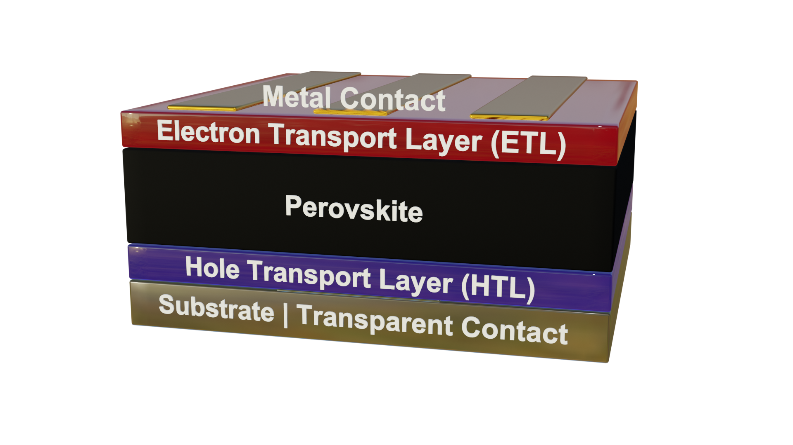

# Exploring Data in NOMAD

In this tutorial, we will learn how to efficiently search and filter entries in NOMAD to find data that matches your criteria.

We will work with the **EXPLORE** page in the NOMAD GUI, starting with an overview of the search and filter options available. We will then use these tools to refine our results step by step.
Finally, we will explore how to create interactive widgets based on selected properties, allowing for a more dynamic and customized filtering experience.

By the end of this tutorial, you will be able to navigate NOMAD with confidence, quickly locate relevant data, and tailor your searches using interactive filters and widgets.

## Navigate to NOMAD's Explore Entries Page

The **EXPLORE** menu allows you to navigate and search through a vast amount of materials-science data. It provides several options, each focuses on a specific application or method. They include different sets of filters and/or search widgets that allow users to efficiently filter and narrow down results, making it easier to find relevant entries in specific domains.

In this tutorial, we will focus on searching data in NOMAD using the **Entries** option within the **EXPLORE** menu. You will see an overview of **SOLAR CELLS** search dashboard.

To start with exploring data across all domains in NOMAD, go to **EXPLORE** → **Entries**.

The **Entries** page shows all the uploaded data that are published on NOMAD. Published entries are accessible without login, while logging in grants access to your private data and those that are shared with you.

??? info "Contents of NOMAD's Explore Menu"

    The following explore pages are currently available:

    - **Entries**: Search entries across all domains.
    - **Theory**: Focus on calculations and materials data derived from theoretical models.
    - **Experiment**: Explore data from experimental sources, such as ELNs (Electronic Lab Notebooks) or characterization techniques e.g., EELS (Electron Energy Loss Spectroscopy).
    -  **Tools**: Explore among several AI toolkit notebooks.
    - **Use Cases**: Search data tailored to specific use cases, such Metal-Organic Frameworks (MOFs).

    

        
    

---

### Search Interface & Filters

In the Entries page, you will find a list of possible filters on the left panel. NOMAD supports advanced searches based on:

- **Material** – Elements, formula, or structure.
- **Method** – Scientific techniques (e.g., DFT).
- **Properties** – Band structure, conductivity, etc.
- **Use Cases** – Application-specific searches (e.g., Solar Cells).
- **Origin** – Filter by uploader, date, dataset, or tags.

    

Filters refine searches dynamically. You can apply the following example to experience this.

- **Material Filter**: Select **B** and **N** to find hexagonal boron nitride.
- **Method Filter**: Find **BN** simulations using **VASP**.
- **Properties Filter**: Search for entries with **band structure** data.

You can pin frequently used filters using **(+)** for a customized search interface.

<!-- update the gif with screenshots with sliding images stack once this is figured out in the docs -->

    

---

### Search Bar: A Quick Way to Explore Data
<!-- Add a page in Reference, that explains all possible syntax for the searches in the search bar -->

You can use the NOMAD search bar to find indexed quantities. As you begin typing, all available
and searchable sets (with their paths in the NOMAD metainfo) appear in the advanced menu below the
search bar. Continue typing to refine the results and select the desired set.

For the example presented above (searching for Boron Nitride):

- Type "Boron" and select *results.material.material_name = Boron*.
- Type "Nitrogen" and select *results.material.material_name = Nitrogen*.

Alternatively, you can directly enter the element paths in the search field:

- *results.material.elements = B*
- *results.material.elements = N*

!!! task "Does NOMAD have a bandgap filter?"
    Can you find a filter for bandgap? Does it provide the bandgap value or indicate direct/indirect nature?

    - Try typing variations like **"bandgap"**, **"band gap"**, or **"band_gap"** into the search bar.
    - Search for **"direct"** or **"indirect"** to explore bandgap characteristics.

In addition, you can also perform range-based searches for values using the search bar. This allows you to find materials with specific properties that fall within a defined numerical range.

For example, if you want to find materials with a band gap of 2 eV or larger, enter the following in the search bar:

- *results.properties.electronic.band_gap.value >= 2 eV*

Similarly, you can define a bounded range for the values. For example, to search for materials with a band gap between 2 eV and 4 eV, enter the following line in the search bar:

- *2 <= results.properties.electronic.band_gap.value <= 4 eV*

---

### Custom Widgets for Advanced Searches

NOMAD enables searching entries using rich metadata. Some metadata is extracted automatically, while others are user-provided via schemas. Only metadata stored according to schemas is searchable.

NOMAD also offers **custom widgets** to create advanced dashboards. These widgets are accessible below the search bar on any **EXPLORE** page.

    

Here are the main four widgets:

- **TERMS:** Visualize and explore categorical data based on user-defined terms and keywords.
- **HISTOGRAM:** Display the distribution of a specific numerical quantity within data.
- **SCATTER PLOT:** Generate scatter plots to visualize relationships between different quantities.
- **PERIODIC TABLE:** Filter data by selecting elements directly from an interactive periodic table.

---

## Example 1: Finding Alternative ETL Materials for Perovskite Solar Cells

In the following, we'll walk through an example to help you better understand how to use these widgets. Imagine we are working on solar cell research and have fabricated solar cell devices using the absorber material *CsPbBr2I* (Cesium Lead Bromine Iodide), a mixed halide perovskite.

**Device Structure**:

    

|Component                         | Material                         |
|----------------------------------|----------------------------------|
|**Top Contact**                   | Au                               |
|**HTL (Hole Transport Layer)**    | Spiro-OMeTAD (C81​H68​N4​O8​)        |
|**Perovskite Absorber**           | CsPbBr2I                         |
|**ETL (Electron Transport Layer)**| TiO2-c (compact Titanium Dioxide)|
|**Bottom Contact**                | FTO (Fluorine-doped Tin Oxide)   |
|**Substrate**                     | SLG (Soda Lime Glass)            |

Now, let us answer the following question:

!!! task "**What ETL materials can replace TiO2-c to improve Voc (open circuit voltage) in perovskite solar cells?**"

    To gain insights into this question, we can utilize NOMAD's widgets to explore relevant data:

    1. **Start with the Periodic Table**:
        - Click on the **PERIODIC TABLE** widget button and use the **(+)** button to pin it to the dashboard.
        - Select the elements of the absorber from the periodic table: Cs, Pb, Br, and I.
        - After selecting these elements, you should see approximately 7,500 entries matching your search filters.

    2. **Use the TERMS Widget**:
        - To find out what ETL and HTL materials are used in the available data, click on the **TERMS** widget button.
        - For the X-axis, type 'electron transport layer'. As you type, suggestions will appear. Choose `results.properties.optoelectronic.solar_cell.electron_transport_layer`.
        - Set the statistics scaling to linear, give the widget a descriptive title like "ETL", and pin it to the dashboard.
        - Repeat the process for the HTL materials.

    3. **Create a Scatter Plot**:
        - Click on the **SCATTER PLOT** widget button to visualize the relationship between open circuit voltage (Voc), short circuit current density (Jsc), and efficiency.
        - Set the X-axis to "Open Circuit Voltage (Voc)", the Y-axis to "Efficiency", and use the marker color to represent "Short Circuit Current Density".
        - The scatter plot will allow you to explore the data interactively.

    

        
    

    4- **Interpreting Results**

    - Interactive scatter plots reveal relationships between **ETLs, HTLs, and performance**.
    - Hover over data points for details.
    - Click entries for **full metadata, dataset links, and publication info**.

    Custom widgets provide a **powerful way** to explore NOMAD data and answer research questions efficiently.

---

## Example 2: Exploring Sn-Based Solar Cells

Let’s explore how **hole transport layer (HTL) materials** affect efficiency in **Sn-based solar cells** with **C60** as the electron transport layer (ETL).

In this example, we will utilize the Solar Cell Explore page, which offers filters and preset widgets that makes it easier to search for solar cell entries.

**Step 1: Navigate to the Solar Cell Explore Page**

- Navigate to **EXPLORE** → **Solar Cells**.
- This dashboard provides predefined filters and plots optimized for solar cell research.

    

The dashboard includes the following preset widgets:

- **Periodic Table:** Filter materials by elements.
- **Scatter Plots:** Explore efficiency vs. Voc, Jsc, and device architecture.
- **Histograms:** Analyze bandgap and illumination intensity.
- **TERMS Plots:** Categorize fabrication method, device stack, ETL, and HTL materials.

**Step 2: Apply Filters**

- Select Sn in the **Periodic Table** to filter Sn-based absorbers.
- Set ETL = C60 in the **TERMS** plot. (~400 entries remain)
- Narrow results further using:
    - Bandgap slider (e.g., >1.3 eV).
    - Device architecture scatter plot (e.g., pin).

**Step 3: Customize Widgets**

Click the *pen icon* on any widget to modify its plotted quantities, color mapping, or units. Each widget offers a customizable set of filters or visualizations, depending on the data type.

**Step 4: Inspect the Results Matching the Criteria**

- Hover over scatter plots to inspect data points.
- Click entries for full metadata, dataset links, and further analysis.

    

---
